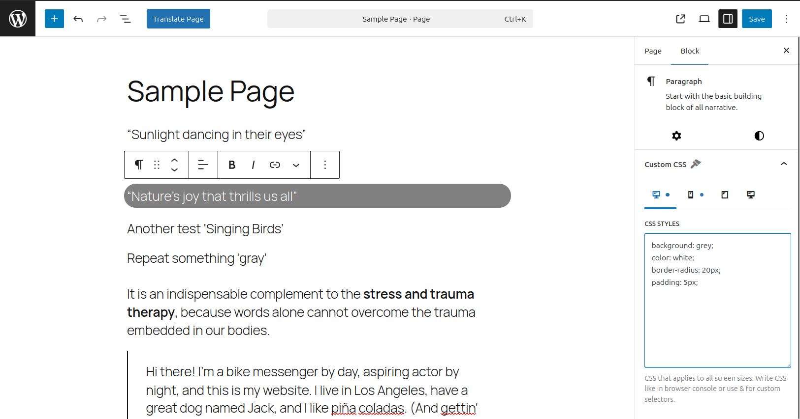
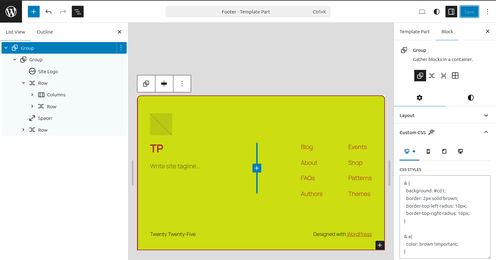

# CSSKube - Block CSS Editor

A WordPress plugin that adds a custom CSS textarea to every Gutenberg block, allowing you to add inline styles without needing custom CSS classes or additional stylesheets.

## Features

- **No Build Process**: Pure JavaScript implementation, no compilation required
- **Block-Level CSS**: Add custom CSS to any Gutenberg block
- **Live Preview**: CSS is applied in real-time in the editor as you type
- **Responsive Design**: Apply CSS to specific screen sizes (Mobile, Tablet, Desktop, or All)
- **Inline Rendering**: CSS is rendered inline with each block on the frontend for optimal performance
- **Persistent Storage**: CSS is stored as block attributes in the post content
- **Two CSS Modes**: Direct properties (like browser console) or custom selectors with `&` placeholder
- **Secure**: Capability checks, CSS sanitization, and output escaping to prevent malicious code injection

## Screenshots

### Live Preview in Block Editor

*The Custom CSS panel with tabbed interface (All, Mobile, Tablet, Desktop). CSS is applied in real-time as you type.*

### Site Editor Support

*Works seamlessly in the Site Editor for template customization. Supports advanced selectors with `&` placeholder.*

## Installation

### From GitHub Releases (Recommended)

1. **Download the latest release:**
   - Visit [Releases](../../releases/latest) page
   - Download `csskube.zip`

2. **Install in WordPress:**
   - Go to WordPress Admin → Plugins → Add New → Upload Plugin
   - Choose the downloaded `csskube.zip` file
   - Click "Install Now" then "Activate"

3. **Start using:**
   - Edit any post or page with the block editor
   - Select a block and look for "Custom CSS" in the block settings sidebar

### Manual Installation

1. Clone or download this repository
2. Ensure the plugin folder is in your WordPress `wp-content/plugins/` directory
3. Activate the plugin from WordPress Admin → Plugins
4. Start editing any post or page with the block editor

### WP-CLI Installation

```bash
wp plugin install https://github.com/sareiodata/csskube/releases/latest/download/csskube.zip --activate
```

## Usage

1. Select any block in the block editor
2. Open the block settings sidebar (click the gear icon if not visible)
3. Scroll down to find the "Custom CSS" panel
4. Click to expand it
5. **Switch between device tabs** to add CSS for specific screen sizes:
   - **All** (💻 icon) - CSS applies to all screen sizes (no media query)
   - **Mobile** (📱 icon) - CSS applies only on screens up to 767px wide
   - **Tablet** (📱 icon) - CSS applies only on screens between 768px and 1024px wide
   - **Desktop** (💻 icon) - CSS applies only on screens 1025px and wider
6. Enter your CSS styles in the textarea for each device type
7. **You can add different CSS for each device!** Switch tabs to add CSS for multiple breakpoints
8. **See the styles applied immediately in the editor** - live preview!
9. The styles will also be rendered on the frontend when you publish/update

### Example CSS

**Direct CSS Properties (like browser console):**
```css
background-color: #f0f0f0;
padding: 20px;
border-radius: 8px;
box-shadow: 0 2px 4px rgba(0,0,0,0.1);
```

**Custom Selectors with & placeholder:**
```css
& {
  background-color: #f0f0f0;
  padding: 20px;
}

&:hover {
  background-color: #e0e0e0;
}

& p {
  color: #333;
  font-size: 18px;
}

& > .custom-class {
  margin-bottom: 10px;
}
```

### Responsive Design Examples

**Complete responsive design for a heading block:**

1. Click on the heading block
2. Open Custom CSS panel
3. Switch to **Desktop** tab and add:
```css
font-size: 48px;
padding: 40px;
color: #333;
```

4. Switch to **Tablet** tab and add:
```css
font-size: 32px;
padding: 20px;
```

5. Switch to **Mobile** tab and add:
```css
font-size: 24px;
padding: 10px;
line-height: 1.2;
```

6. Switch to **All** tab and add (applies to all sizes):
```css
font-weight: bold;
text-align: center;
```

**Result:** You now have a fully responsive heading with:
- Bold and centered on all devices (All tab)
- Large text on desktop
- Medium text on tablet
- Small text on mobile
- All in one block!

### Important Notes

- **Direct CSS properties**: Write CSS like in browser console (no selectors needed)
- **Custom selectors**: Use `&` as a placeholder for the current block
- **Standard CSS properties**: Use any valid CSS properties
- **Live preview**: Changes appear instantly in the editor as you type
- **Frontend rendering**: CSS is rendered inline on the frontend for each block
- **Unique IDs**: Each block gets a unique ID automatically on the frontend
- **Existing IDs**: If a block already has an ID, the plugin uses a class instead

## How It Works

### Block Attribute
The plugin adds a `cssKubeCSS` attribute to all blocks to store the custom CSS.

### Editor Integration
Using WordPress hooks, the plugin:
1. Adds a "Custom CSS" panel to the block inspector controls
2. Provides a textarea for entering CSS
3. Saves the CSS as a block attribute
4. **Applies CSS in real-time** by injecting a `<style>` element in the editor's `<head>`
5. Uses the block's `clientId` to scope styles with `data-block` attributes

### Frontend Rendering
When rendering blocks on the frontend:
1. The plugin checks for the `cssKubeCSS` attribute
2. Reads the `cssKubeMediaQuery` attribute (mobile, tablet, desktop, or all)
3. Generates a unique ID for the block based on content and CSS
4. Adds the ID to the first HTML element in the block (or as a class if ID exists)
5. Processes the CSS:
   - **Direct properties**: Wraps them with `#block-id { properties }`
   - **Custom selectors**: Replaces `&` with the block selector
6. Wraps the CSS in the appropriate media query if specified
7. Injects the `<style>` tag before the block content

### CSS Processing Examples

**Input (direct properties):**
```css
background: red;
padding: 20px;
```

**Output:**
```html
<style>#csskube-abc123 { background: red; padding: 20px; }</style>
<p id="csskube-abc123">Block content</p>
```

**Input (custom selectors):**
```css
& { background: red; }
&:hover { background: blue; }
& p { color: white; }
```

**Output:**
```html
<style>
#csskube-abc123 { background: red; }
.csskube-abc123 { background: red; }
#csskube-abc123:hover { background: blue; }
.csskube-abc123:hover { background: blue; }
#csskube-abc123 p { color: white; }
.csskube-abc123 p { color: white; }
</style>
<p id="csskube-abc123">Block content</p>
```

Note: CSS rules are duplicated with both ID and class selectors to ensure they work whether the block receives an ID or class.

**Input (with media query - Mobile):**
```css
padding: 10px;
font-size: 14px;
```

**Output:**
```html
<style>
@media (max-width: 767px) {
  #csskube-abc123, .csskube-abc123 {
    padding: 10px;
    font-size: 14px;
  }
}
</style>
<p id="csskube-abc123">Block content</p>
```

## File Structure

```
csskube/
├── csskube.php                 # Main plugin file
├── js/
│   └── block-css-control.js   # Block editor JavaScript
├── css/
│   └── editor-styles.css      # Editor UI styles
└── README.md                   # This file
```

## Requirements

- WordPress 6.0 or higher
- PHP 7.4 or higher
- Block editor (Gutenberg)
- **`unfiltered_html` capability** (Administrators only by default)

## Security

CSSKube implements multiple security layers to protect your site:

- **Capability Checks**: Only users with `unfiltered_html` capability (Administrators) can add custom CSS
- **CSS Sanitization**: Removes dangerous CSS properties, expressions, and imports
- **Output Escaping**: All CSS is escaped before rendering using WordPress's `wp_kses()`
- **No External Execution**: Blocks `javascript:`, `expression()`, `@import`, and other dangerous patterns

**Important:** Only grant custom CSS access to users you fully trust. CSS can be used to style your site maliciously if in the wrong hands.

For detailed security information, see [SECURITY.md](SECURITY.md).

### Customizing Required Capability

By default, only Administrators can use custom CSS. You can change this with a filter:

```php
// Allow editors to use custom CSS (not recommended)
add_filter( 'csskube_required_capability', function() {
    return 'edit_posts';
});
```

## Browser Support

Works with all modern browsers that support the WordPress block editor.

## License

GPL v2 or later

## Support

For issues or feature requests, please contact Cozmoslabs.

## For Developers

### Automated Releases

This plugin uses GitHub Actions to automatically create releases when you push a version tag.

**How to create a new release:**

1. **Commit your changes:**
   ```bash
   git add .
   git commit -m "Your changes"
   git push
   ```

2. **Create and push a version tag:**
   ```bash
   git tag -a v1.3.2 -m "Version 1.3.2 - Brief description"
   git push origin v1.3.2
   ```

3. **GitHub automatically:**
   - Creates a clean plugin zip (excludes `.md`, `.sh`, and config files)
   - Creates a GitHub Release with release notes
   - Uploads `csskube.zip` and `csskube-X.X.X.zip` as downloadable assets

**Download URLs:**
- Latest: `https://github.com/sareiodata/csskube/releases/latest/download/csskube.zip`
- Specific: `https://github.com/sareiodata/csskube/releases/download/v1.3.1/csskube.zip`

**What gets included in releases:**
- `csskube.php` (main plugin file)
- `js/block-css-control.js` (editor JavaScript)
- `css/editor-styles.css` (editor styles)

**What gets excluded:**
- All `.md` files (README, CLAUDE, SECURITY, etc.)
- `.sh` scripts (test-plugin.sh)
- `.gitattributes` and `.gitignore`
- `.github/` directory

The exclusion list is defined in `.gitattributes`.

## Changelog

### 1.3.1
- **UX**: Added visual indicators (blue dots) on tabs that contain CSS
- **UX**: Tabs with CSS show a subtle pulsing animation to draw attention
- **UX**: Panel now opens to the first tab that has CSS content
- Improved tab discovery and navigation

### 1.3.0 (Major Feature Release)
- **NEW**: Tabbed interface for managing CSS across all breakpoints simultaneously
- Added 4 device tabs with icons: All, Mobile, Tablet, Desktop
- Each tab has its own textarea - add CSS for multiple devices at once!
- Removed single dropdown in favor of tabbed interface
- All 4 CSS fields are processed and output together
- Live preview in editor shows all breakpoints simultaneously
- Updated attributes: `cssKubeCSS_all`, `cssKubeCSS_mobile`, `cssKubeCSS_tablet`, `cssKubeCSS_desktop`
- Improved tab styling with hover effects and active states
- Icons for each device type (Dashicons)

### 1.2.0 (Feature Release)
- **NEW**: Added responsive design support with device-specific CSS
- Added "Apply CSS to" dropdown with options: All Devices, Mobile, Tablet, Desktop
- CSS is automatically wrapped in appropriate media queries
- **Breakpoints:**
  - Mobile: max-width 767px
  - Tablet: 768px to 1024px
  - Desktop: min-width 1025px
- Live preview works with media queries in the editor
- Frontend rendering respects media query settings

### 1.1.1
- **BUGFIX**: Fixed `&` placeholder replacement for descendant selectors
- `& button` now correctly outputs `#id button, .class button` instead of `#id, .class button`
- Ensures CSS targeting child elements works properly

### 1.1.0 (Security Release)
- **SECURITY**: Added capability checks - requires `unfiltered_html` capability (Administrators only)
- **SECURITY**: Comprehensive CSS sanitization to prevent malicious code injection
- **SECURITY**: Output escaping with `wp_kses()` for all CSS content
- **SECURITY**: Blocks dangerous CSS properties: `expression()`, `@import`, `behavior`, `-moz-binding`
- **SECURITY**: Removes JavaScript protocols: `javascript:`, `vbscript:`, `data:text/html`
- Added `csskube_required_capability` filter for customization
- Added SECURITY.md with detailed security documentation
- Replaced `serialize()` with `wp_json_encode()` for better performance

### 1.0.3
- Fixed Site Editor live preview - CSS now properly injected into iframe document
- Simplified CSS selectors for better compatibility
- Improved handling of iframe document for Site Editor

### 1.0.2
- Fixed CSS being applied to List View sidebar (unintended side effect)
- Added Site Editor compatibility - CSS now works in template/theme editor
- Made CSS selectors more specific to target only block canvas

### 1.0.1
- Added live CSS preview in the editor
- CSS is now applied in real-time as you type
- Removed CSS badge indicator in favor of live styling
- Improved block ID injection reliability

### 1.0.0
- Initial release
- CSS textarea for all blocks
- Inline rendering
- No build process required
